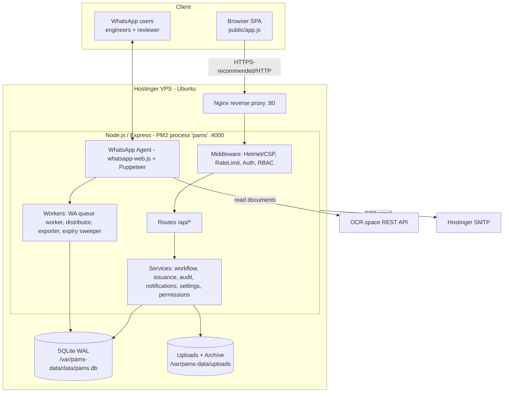
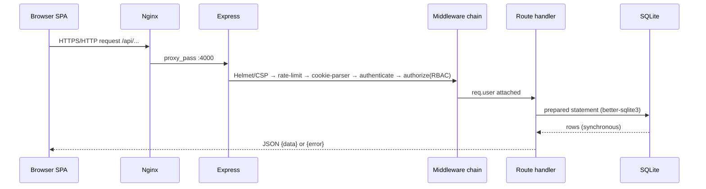
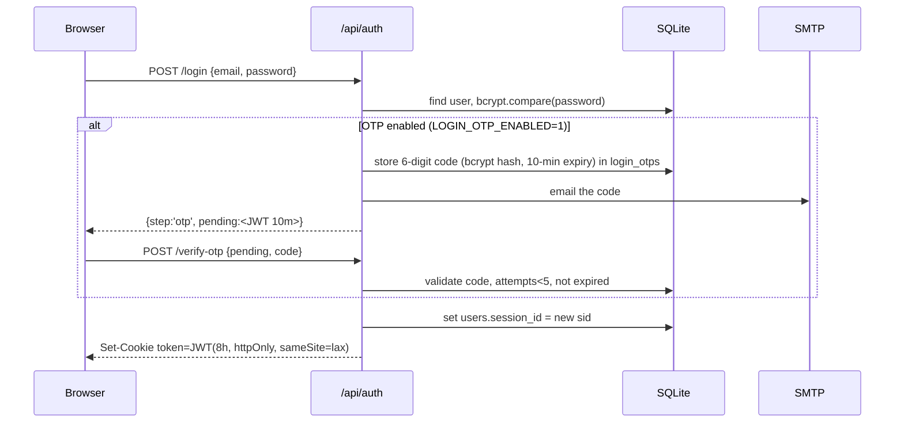
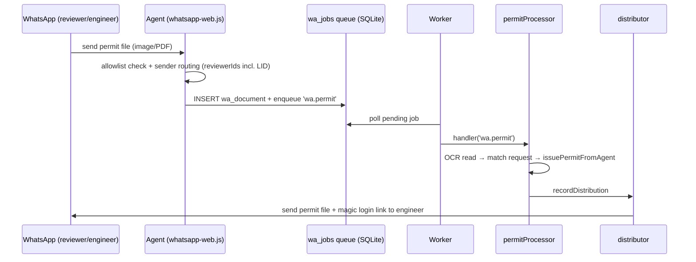
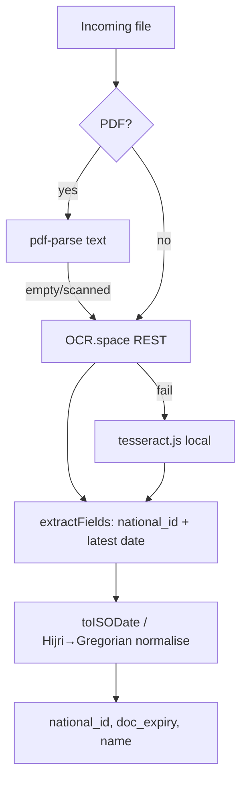
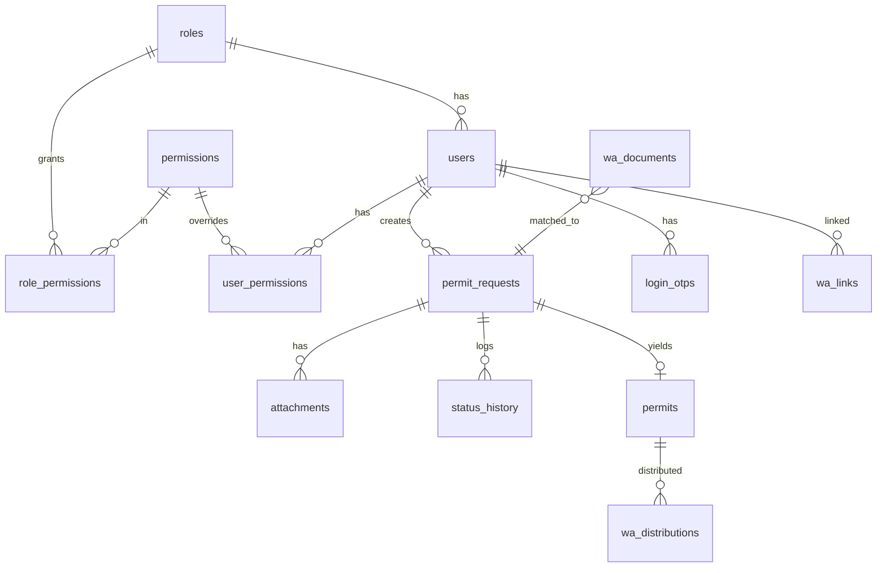
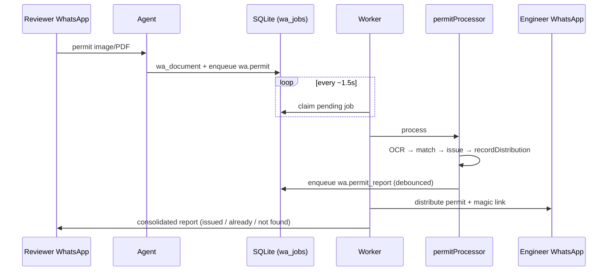
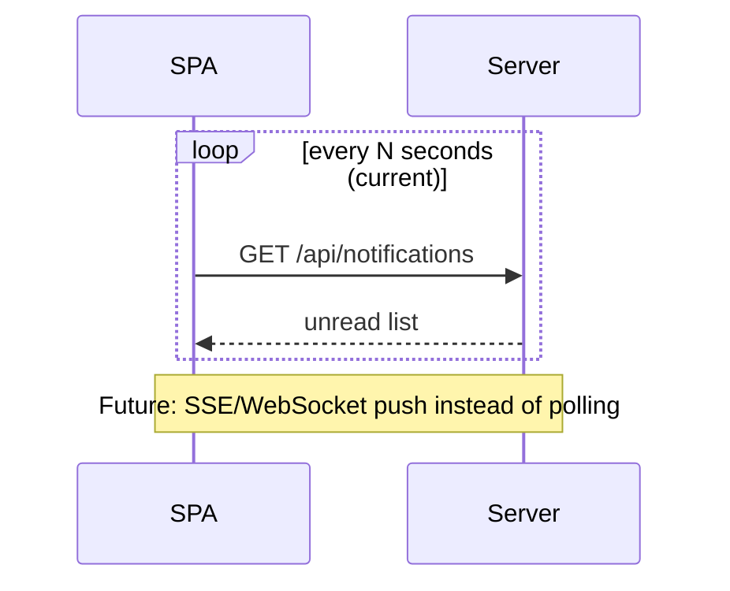
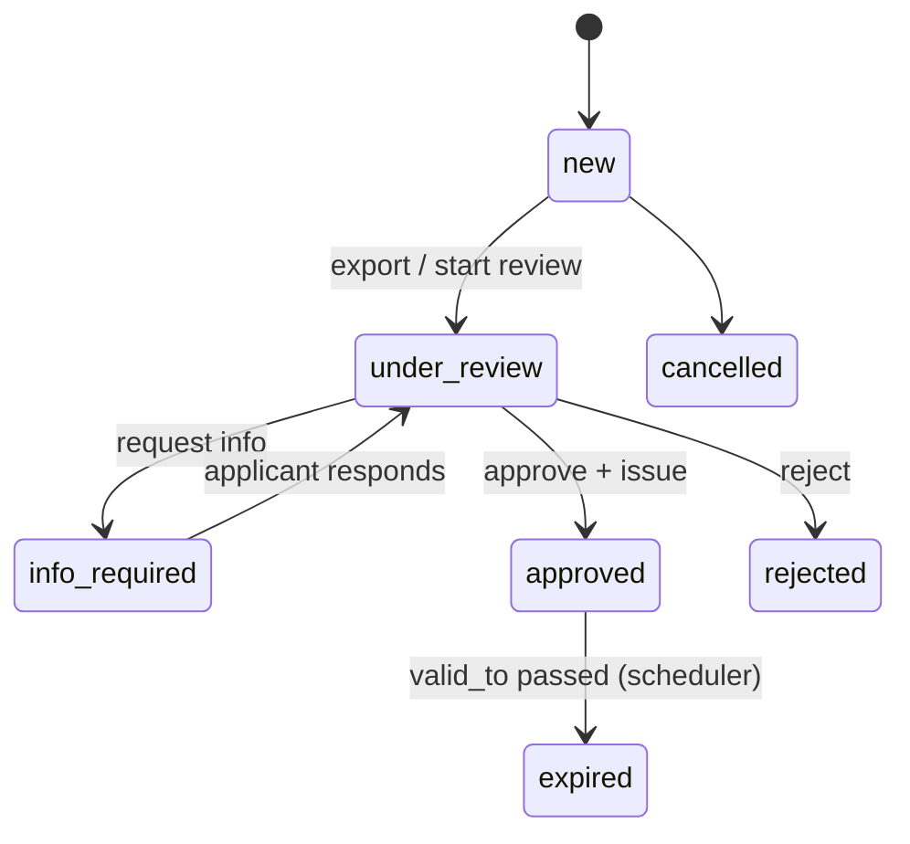

# PAMS — Permit & Approval Management System
## Complete Technical Documentation (MAB Trading & Contracting)

> **Accuracy note:** This document describes the system **as actually implemented** in this repository. Where a feature commonly expected in enterprise systems is **not** present, it is explicitly marked **(Not implemented / Recommended future)** rather than invented. Treat those items as a credible roadmap.

---

## 1. Executive Summary

**What is the project?**
PAMS is an internal web platform that automates the lifecycle of **worker site-entry permits** for MAB Trading & Contracting (e.g., Qiddiya project sites such as *WATER PARK HOTEL* / *GRAND HOTEL*). It couples a role-based web application with a **WhatsApp agent** and **OCR document reading** to move a permit from request to issuance with minimal human effort.

**What business problem does it solve?**
Previously, issuing entry permits was manual: collecting ID/Iqama documents, filling spreadsheets, emailing the authority, and tracking each worker by hand — slow, error-prone, and hard to audit. PAMS digitises and automates this: engineers submit on the site, the system batches and exports to the reviewer, the authority returns permits, the WhatsApp agent reads them (OCR), matches them to requests, issues, and distributes the permit back to the engineer with a one-click login link.

**Who uses it?**
- **Applicant (مقدّم الطلب / engineer):** submits permit requests (single or multi-person).
- **Reviewer (مراجِع):** reviews, forwards to the authority, returns issued permits.
- **Supervisor (المشرف):** monitors applicants and their activity.
- **General Management (الإدارة العامة):** read-only analytics dashboard.
- **Support (الدعم الفني):** full administration (users, permissions, settings, system health).

**Why was it built?**
To cut permit turnaround from hours to under a minute, eliminate duplicate/erroneous submissions, provide a complete audit trail, and let non-technical staff operate the whole flow from the website + WhatsApp.

---

## 2. Complete System Architecture

### 2.1 Overall architecture
A **modular monolith**: a single Node.js/Express process serving a vanilla-JS Single-Page Application (SPA), a synchronous SQLite database, and a set of background workers (WhatsApp queue, distributor, exporter, expiry sweeper). Deployed on a single VPS behind Nginx, managed by PM2.



### 2.2 Client–Server architecture
Thin server-rendered shell (`index.html`) + a client-side SPA (`app.js`) that talks to a JSON REST API under `/api`. No server-side templating per page; the browser renders views and calls the API with `fetch`. Session is carried by an **httpOnly JWT cookie**.

### 2.3 SaaS Multi-Tenant architecture
**Not implemented.** PAMS is **single-tenant** (one MAB deployment, one database). Multi-tenancy (tenant_id scoping, per-tenant isolation, subdomain routing) is a **recommended future** step if PAMS becomes a product sold to multiple companies.

### 2.4 Request flow (web)


### 2.5 Authentication flow


### 2.6 Data flow (permit lifecycle)


### 2.7 API flow
All endpoints live under `/api`, return JSON, and (except `/api/auth/login`, `/verify-otp`, `/resend-otp`, `/magic/:token`, `/api/health`, `/api/verify/*`) require the auth cookie + role/permission checks. Errors use a uniform `{ "error": "<message>" }` shape with appropriate HTTP status.

### 2.8 WhatsApp flow


### 2.9 OCR flow


### 2.10 Notification flow
In-app notifications are written to the `notifications` table by `services/notifications.js`. The SPA **polls** `/api/notifications` periodically (no WebSocket). WhatsApp “notifications” (permit delivery, reports) are sent through the outbound/distributor queues.

### 2.11 File upload flow
`multer` (memory→disk) handles multipart uploads on request creation and permit issuance. Files are written under `/var/pams-data/uploads`, recorded in `attachments` (with SHA-256 checksum, mime, size), and copied into a per-request **archive folder** by `services/requestArchive.js`.

---

## 3. Technologies (and why)

| Layer | Technology | Why chosen |
|---|---|---|
| Language | **JavaScript (ESM)**, Node ≥ 20 | One language across server, client, and tooling; huge ecosystem; fast to iterate for a small team. |
| Backend framework | **Express 4** | Minimal, battle-tested, unopinionated; ideal for a focused REST API. |
| Database | **SQLite** via **better-sqlite3** | Zero-ops, single-file, *synchronous* (simpler code, no callback/promise overhead), excellent for a single-node moderate-write workload. WAL mode for concurrent reads. |
| Frontend | **Vanilla JS SPA + HTML + CSS** | No build step, trivial deploy (static files served by Express), full control, tiny footprint. |
| Auth | **jsonwebtoken**, **bcryptjs**, **cookie-parser** | Standard JWT sessions in httpOnly cookies; bcrypt for password hashing. |
| Security headers | **helmet** (+ CSP) | One-line hardening of HTTP response headers. |
| Rate limiting | **express-rate-limit** | Brute-force / flood protection on login and API. |
| File upload | **multer** | De-facto multipart handler for Express. |
| WhatsApp | **whatsapp-web.js** (+ bundled **Puppeteer/Chromium**), **qrcode-terminal** | No paid WhatsApp Business API required; drives a real linked-device session. |
| OCR | **OCR.space** (REST), **tesseract.js** (fallback), **pdf-parse** | Free, accurate cloud OCR with a local fallback; pdf-parse for text PDFs. |
| Email | **nodemailer** (SMTP) | Standard SMTP client for login OTP. |
| IDs | **nanoid**, `crypto.randomUUID` | Collision-resistant identifiers. |
| Config | **dotenv** | 12-factor env configuration. |
| Process manager | **PM2** | Auto-restart, log management, boot persistence. |
| Reverse proxy | **Nginx** | TLS termination (when enabled), proxying, static caching, security. |
| Hosting | **Hostinger VPS (Ubuntu)** | Cost-effective full control (needed for Puppeteer/Chromium). |
| Version control | **Git + GitHub** | History, rollback, deploy via `git pull`. |
| CI/CD | **Not implemented** (manual `git pull && pm2 restart`) | Recommended future: GitHub Actions. |
| Containerisation | **Not implemented** (bare Node on VPS) | Recommended future: Docker. |

---

## 4. Backend Deep Dive

### 4.1 Project structure
```
src/
├── server.js              # bootstrap: Helmet/CSP, rate-limit, route mount, schedulers, listen
├── config.js              # env → typed config object (jwt, smtp, wa, gatepass, paths…)
├── routes/                # HTTP endpoints (controllers)
│   ├── auth.js            # login, OTP, magic link, undertaking, tour, logout, me
│   ├── requests.js        # create/list/detail requests, reviewer actions, export, submission window
│   ├── permits.js         # issued permits, document download
│   ├── users.js           # user CRUD, password view/reset, performance, undertakings list
│   ├── audit.js           # audit log queries
│   ├── reports.js         # analytics for dashboards
│   ├── verify.js          # public permit verification (verify_token)
│   ├── notifications.js   # in-app notifications
│   ├── wa-admin.js        # WhatsApp/admin: links, queue, settings, DB viewer, applicants
│   └── testMatch.js       # OCR match proof-of-concept (read-only)
├── middleware/
│   ├── auth.js            # JWT verify + single-session check → req.user
│   ├── rbac.js            # authorize(...rolesOrPermissions)
│   ├── upload.js          # multer config
│   └── error.js           # asyncHandler + uniform error handler + httpError()
├── services/              # business logic (no HTTP concerns)
│   ├── workflow.js        # status transitions + blocking rules
│   ├── issuance.js        # issuePermitFromAgent (atomic permit creation)
│   ├── audit.js           # append-only audit log
│   ├── notifications.js   # in-app notify()
│   ├── settings.js        # DB-backed settings (export window, reviewer numbers, undertaking text…)
│   ├── permissions.js     # RBAC catalog + getEffectivePermissions()
│   ├── mailer.js          # SMTP (nodemailer) + OTP email template
│   ├── permitMatcher.js   # legacy direct OCR match
│   ├── requestArchive.js  # per-request folder archive
│   └── wa/                # WhatsApp platform (queue, agent helpers, processors)
│       ├── queue.js        # wa_jobs worker + registerHandler/enqueue + DLQ
│       ├── idExtractor.js  # OCR cascade (OCR.space → tesseract) + field extraction
│       ├── permitProcessor.js # reviewer permit → match → issue → distribute → report
│       ├── distributor.js  # send permit + magic link to engineer (separate queue)
│       ├── exporter.js     # Excel export to reviewer at window close
│       ├── packageBuilder/batchProcessor # (engineer-doc path, dormant in hybrid mode)
│       ├── linking.js / outbound.js / waClient.js / rateLimiter.js
│       └── ...
├── db/
│   ├── index.js           # open DB, apply schema, lightweight migrations (ensureColumn), seed hooks
│   ├── schema.sql         # canonical schema (idempotent, IF NOT EXISTS)
│   ├── seed.js            # default roles/permissions/admin
│   ├── set-admin.js       # CLI: reset/create admin
│   └── passwordWatch.js   # backfill password_plain + apply set_password
└── utils/                 # jwt, secret (encryptPw/decryptPw), nationalId, numbers, dateNormalize, gatepass, xlsx, magicLink
```

### 4.2 Controllers / Routes
Each file under `routes/` is an Express `Router`. They parse input, call `authorize(...)`, invoke services, and shape the JSON response. Heavy logic lives in `services/` (a pragmatic controller→service split; there is **no formal repository layer** — data access uses prepared statements inline or in services).

### 4.3 Middleware
- **authenticate** (`middleware/auth.js`): reads the JWT from cookie/Authorization header, verifies signature, loads the user, and enforces **single active session** (`decoded.sid === users.session_id`).
- **authorize** (`middleware/rbac.js`): accepts a mixed list of **role codes and permission codes**; passes if the user’s role matches or the user holds the permission (`getEffectivePermissions`).
- **upload**: multer with size/type limits.
- **error**: `asyncHandler` wraps async routes; `errorHandler` returns `{error}` with status; `httpError(status,msg)` creates user-safe errors (server 5xx messages are masked).

### 4.4 Configuration & environment variables
`config.js` centralises all env reads. Key variables: `JWT_SECRET`, `JWT_EXPIRES_IN` (8h), `DATA_DIR`, `WHATSAPP_ENABLED`, `WHATSAPP_ALLOWED`, `WA_PIPELINE_ENABLED`, `WA_REVIEWER_NUMBER` (phone + optional LID), `OCRSPACE_API_KEY`, `ANTHROPIC_API_KEY` (optional), `LOGIN_OTP_ENABLED`, `SMTP_*`, `BASE_URL`, `MAGIC_LINK_DAYS`, `DEFAULT_PERMIT_DAYS`. Production refuses to boot with a weak `JWT_SECRET`.

### 4.5 Coding style, error handling, response structure
ESM modules; small pure-ish functions; synchronous DB calls; consistent `{error}` failures and resource-shaped success bodies (`{rows,total}`, `{request,attachments,history,permit}`, etc.). **Dependency injection:** none formal — modules import the shared `db` and `config` singletons.

---

## 5. Frontend Deep Dive

- **Architecture:** a single IIFE (`App`) in `public/app.js` — a hand-rolled SPA. `index.html` is the shell; `styles.css` the design system; `login-fx.js` the login animation.
- **Routing:** in-memory key→view map (`route(key)` calls `viewX()` which renders into `#content`); navigation comes from a per-role `NAV` table.
- **Pages/Views:** login, OTP step, undertaking (e-signature), guided tour, my-requests, new-request (multi-person), my-permits, inbox, permits, dashboard, management, supervisor, workflow, users, permissions, undertakings, settings, database viewer, system-health, audit, notifications.
- **State management:** module-scoped variables (`user`, timers) — no framework store.
- **Authentication (client):** login → cookie set by server; `boot()` calls `/auth/me`; a `sessionStorage` “tab” flag controls re-entry; magic-link entry (`?m=1`) preserves the session.
- **Forms/Validation:** native HTML5 validation + custom checks (English-only names, national-ID format, in-batch duplicate guard, eligibility lookups).
- **API communication:** a single `api(path,{method,body,form})` helper using `fetch` with `credentials:'same-origin'`; 401 → toast + redirect.
- **Responsive/RTL:** mobile sidebar, fluid layouts, full RTL Arabic.
- **Loading/Empty/Error states:** “جارٍ التحميل…”, empty-state messages, toasts.
- **Theme:** dark/light via `body` class + `localStorage`; font-size controls.
- **UI/Icons/Animations:** custom CSS, Unicode/SVG icons, scroll/hover micro-animations, guided-tour overlay, command palette.

---

## 6. Database

### 6.1 Engine & rationale
**SQLite** (file `pams.db`) via **better-sqlite3** in **WAL** mode. Chosen for zero operational overhead, atomic single-file backups, synchronous simplicity, and more-than-adequate performance for a single-node workload with modest write volume. **Future scalability:** migrate to **PostgreSQL** when concurrency/HA demands grow (schema is standard SQL; the main change is the driver and a few SQLite-isms).

### 6.2 Tables (18)
`roles`, `permissions`, `role_permissions`, `user_permissions`, `users`, `permit_requests`, `permits`, `attachments`, `status_history`, `audit_logs`, `notifications`, `sequences`, `wa_links`, `wa_jobs`, `wa_documents`, `wa_packages`, `wa_distributions`, `login_otps`, plus `app_settings` (created at runtime by `settings.js`).

Representative columns:
- **users:** id, full_name, email (unique), password_hash (bcrypt), **pw_enc / password_plain / set_password** (reversible-password convenience + DB-driven reset), role_id, is_active, session_id, last_login_at, last_activity_at, undertaking_accepted_at/pdf_key/signature/name, tour_completed_at.
- **permit_requests:** id, request_number (unique), national_id, id_type, applicant_name, beneficiary_name, sponsorship, first/last name, nationality, dob, doc_expiry, visit_location, status, created_by, assigned_to, exported_at, submitted_at.
- **permits:** id, permit_number (unique), request_id (FK), national_id, holder_name, status (active/expired), valid_from/to, issued_by, verify_token, permit_file_id, last_expiry_notice.
- **attachments:** id, request_id (FK), file_type, original_name, storage_key, mime_type, size_bytes, checksum.
- **status_history / audit_logs:** immutable transition + action trails (who/what/when, old/new).
- **wa_jobs:** id, type, payload (JSON), status (pending/processing/done/failed/**dead**), attempts, max_attempts, run_after — the durable queue.
- **wa_documents / wa_distributions / wa_links:** inbound files, permit distribution records, number↔user links.
- **login_otps:** user_id, code_hash (bcrypt), expires_at, attempts.

### 6.3 Keys, relationships, indexes, constraints
- **Primary keys:** TEXT UUIDs (or AUTOINCREMENT for log tables).
- **Foreign keys:** `permits.request_id→permit_requests`, `attachments.request_id→permit_requests`, `status_history.request_id→permit_requests`, `users.role_id→roles`, `role_permissions/user_permissions→permissions`.
- **Unique constraints:** `users.email`, `permit_requests.request_number`, `permits.permit_number`, **`uq_active_permit_per_id`** (partial unique index: one *active* permit per national_id), `wa_distributions.permit_id`.
- **Indexes:** on `permit_requests(status)`, `(national_id)`, `(assigned_to)`, `permits(national_id)`, `wa_jobs(status, run_after)`, `wa_documents(national_id)`, etc.
- **Triggers:** none (logic enforced in code/transactions).
- **Migrations:** schema is idempotent (`IF NOT EXISTS`); incremental columns added via `ensureColumn()`; one table rebuild migrated `wa_jobs` to allow the `dead` state.
- **Backup strategy:** manual file copy (`pams.db` + `-wal` + `-shm`). **Recommended:** scheduled `cron` copy / `sqlite3 .backup` off-site.

### 6.4 ERD


---

## 7. Authentication & Authorization

- **Login:** email + bcrypt-verified password.
- **2FA (email OTP):** optional (`LOGIN_OTP_ENABLED`); 6-digit code, bcrypt-hashed, 10-min expiry, ≤5 attempts, delivered by SMTP; a short-lived `pending` JWT links the two steps.
- **Session:** stateless **JWT** (HS256, 8h) stored in an **httpOnly, sameSite=lax** cookie; `secure` auto-enabled under HTTPS. **Single active session** via `session_id` (new login or logout invalidates prior tokens).
- **Magic link:** signed JWT (`purpose:'magic'`, default 14 days) → `GET /api/auth/magic/:token` mints a session and redirects; used to one-click engineers into the site from WhatsApp.
- **Password hashing:** **bcryptjs** (not Argon2). A reversible encrypted copy (`pw_enc`) + readable `password_plain` + a DB-edit watcher (`set_password`) exist for **admin recovery** — a deliberate convenience that trades some secrecy for operability (documented risk: protect DB access; **recommended** to drop in a hardened deployment).
- **Refresh tokens:** **Not implemented** (single 8h token). Recommended future for longer sessions.
- **Password reset / email verification:** reset via Support UI or `set-admin.js`; account-verification flow is **not** separate (OTP at login covers identity).
- **RBAC + permissions:** five roles (`applicant, reviewer, supervisor, general_management, support`) plus a **granular permission catalog** (`permissions.js`): role defaults in `role_permissions`, per-user overrides in `user_permissions`. `authorize()` accepts roles or permission codes; `getEffectivePermissions(userId)` merges them.
- **Multi-tenant isolation:** **Not applicable** (single tenant).

---

## 8. API Documentation (selected, representative)

All under `/api`; all JSON; cookie auth unless noted. Errors: `{ "error": "<msg>" }`.

**Auth**
| Method | Endpoint | Auth | Body | Success | Errors |
|---|---|---|---|---|---|
| POST | /auth/login | none | {email,password} | {token,user} or {step:'otp',pending,email} | 400, 401, 500(otp) |
| POST | /auth/verify-otp | none | {pending,code} | {token,user} | 400/401/429 |
| POST | /auth/resend-otp | none | {pending} | {ok} | 401/500 |
| GET | /auth/magic/:token | none | — | 302 redirect /?m=1 | 401 |
| GET | /auth/me | cookie | — | {user} | 401 |
| GET | /auth/undertaking-text | cookie | — | {title,body} | 401 |
| POST | /auth/undertaking | applicant | {full_name,signed_at,signature} | {ok,user} | 400 |
| POST | /auth/tour-complete | cookie | — | {ok,user} | — |
| POST | /auth/logout | — | — | {ok} | — |

**Requests**
| GET | /requests | role | ?status,q,page,pageSize | {rows,total} |
| GET | /requests/:id | owner/staff | — | {request,attachments,history,permit} |
| POST | /requests | applicant/supervisor/`create_requests` (+submissionGate) | multipart | {id,request_number,status:'new'} |
| GET | /requests/eligibility/:nid | create perms | — | {eligible, reason, renewal} |
| GET | /requests/submission-window/status | create perms | — | {allowed,message,secondsRemaining,start,end,spam} |
| GET | /requests/export.xlsx | reviewer/support | ?status,ids,mode | xlsx (and flips new→under_review) |
| POST | /requests/:id/approve-issue | reviewer | multipart(permit_file)+dates | {ok,permit_number} |
| POST | /requests/:id/{reject,request-info,release,respond,start-review} | reviewer/owner | {reason}/docs | {ok} |

**Users / Admin**
| GET | /users | support/supervisor/`manage_users` | — | {rows} |
| GET | /users/:id/password, POST /users/:id/password | support | — / {password} | reveal / reset |
| GET | /users/undertakings | support/supervisor | — | signed-pledge list |
| GET/PUT | /wa/settings | support | settings | live settings (export window, reviewer numbers, allowlist, undertaking, submit window) |
| GET | /wa/db/tables, /wa/db/table/:name | support | — | read-only DB viewer |
| GET | /api/health | none | — | {ok,time} |

(Every other route follows the same pattern: method + path + RBAC + validation + `{data}`/`{error}`.)

---

## 9. WhatsApp Agent

- **Library:** **whatsapp-web.js** driving headless **Chromium (Puppeteer)** as a linked device. Chosen because it needs **no paid WhatsApp Business API**, supports media, and runs on a VPS. *Alternatives:* official WhatsApp Cloud API (paid, more stable, requires business verification), Baileys (lighter, no browser). *Future:* migrate to the official Cloud API for reliability/compliance at scale.
- **Connection / QR / session:** `LocalAuth` persists the session under `/var/pams-data/wa-session`; first link shows a QR in the PM2 logs (`qrcode-terminal`); subsequent boots reuse the session.
- **Reconnect strategy:** on `disconnected`/`auth_failure`, an **exponential backoff** (8s→16s→32s→60s) destroys and re-initialises the client until reconnected — the agent self-heals without manual restart.
- **Message queue:** inbound files are persisted (`wa_documents`) and a job is **enqueued in `wa_jobs`**. A worker polls, runs the registered handler, **retries** on failure, and moves exhausted jobs to a **dead-letter** state. The queue is durable (survives restarts).
- **Receiving / routing:** allowlist gate; sender classified as **reviewer** (matches `WA_REVIEWER_NUMBER` phone **or** long LID) → permit path, else applicant/legacy path.
- **Sending / media / rate limiting:** `outbound.js` + a separate **distributor** queue; independent **rate limiters** per queue (e.g., 10 ops then pause) to avoid WhatsApp bans.
- **Document/PDF processing:** OCR cascade (below). **Logging/monitoring:** console logs via PM2; a **System Health** page surfaces queue/distribution/job status.



---

## 10. OCR

- **How it works:** for images, send to **OCR.space** (Engine 2); on failure fall back to **tesseract.js** (ara+eng). For PDFs, try **pdf-parse** text first; if scanned/empty, OCR.space with `filetype=PDF`.
- **Extraction:** regex finds a valid **10-digit national ID/Iqama** (prefer the number labelled “Iqama/إقامة”), the English name (longest 2-word line), and dates; the **latest date** is taken as the permit expiry.
- **Validation/normalisation:** `utils/nationalId.js` validates format (Iqama = format-only; National ID = Luhn-style check); `utils/dateNormalize.js` converts `DD/MM/YYYY`/Arabic-Indic digits/Hijri → ISO `YYYY-MM-DD`.
- **Confidence / manual review:** a heuristic confidence score is computed; unmatched/invalid documents are reported back (“no matching request”) for **manual handling**; the reviewer can always issue manually on the site.
- **Performance:** one network OCR call per document; tesseract fallback is CPU-bound (45s timeout). *(Claude Vision was previously integrated and is optional/disabled.)*

---

## 11. Real-Time Communication

**Current implementation:** **polling** — the SPA periodically GETs `/api/notifications` and dashboard endpoints; the WhatsApp pipeline is event-driven internally via the **DB job queue** (near-real-time). **Socket.IO / native WebSockets / SSE are not implemented.**

**Recommended future:** add **SSE** (simplest, one-way server→client for notifications/dashboards) or **Socket.IO** (bi-directional, rooms per user/role) with Redis pub/sub for multi-instance scaling.



---

## 12. Workflow Engine

**Request states:** `new → under_review → info_required → approved | rejected | expired | cancelled`. (“sent/completed/archived” map to *under_review/approved* + the file archive.)

- **Transitions:** centralised in `services/workflow.js` (`changeStatus`, `checkPermitBlocking`, `getActivePermit`); every change writes `status_history` and an `audit_logs` entry.
- **Who:** applicants create (`new`) and respond to `info_required`; reviewers move `under_review/info_required/approved/rejected/released`; export flips `new→under_review`; the scheduler expires permits.
- **Business rules:** one open request **and** one active permit per national_id (`uq_active_permit_per_id`); approval requires an attached permit file; renewals only via the renewal path within the renewal window.
- **Issuance:** `issuance.js` performs an **atomic transaction** (ensure under_review → approved → expire old permit → save file → insert permit), with date normalisation and a default validity fallback.



---

## 13. Security

**Implemented:** bcrypt password hashing; JWT in **httpOnly/sameSite** cookie; **single active session**; **RBAC + per-user permissions**; **Helmet + CSP**; **rate limiting** (login 10/15-min, API 300/min); WhatsApp **allowlist**; **append-only audit log**; SHA-256 attachment checksums; strict **input validation** + duplicate prevention; SQL-injection-safe **prepared statements** (better-sqlite3, parameterised); production refuses weak `JWT_SECRET`; file-type/size limits on upload; DB-viewer masks secret columns.

**Not yet / recommended (be transparent):**
- **HTTPS/TLS/HSTS:** **not enabled yet** (served over HTTP/IP) — **top priority**: domain + Let’s Encrypt (or Cloudflare).
- **CSRF:** mitigated by sameSite cookies + JSON API; add explicit CSRF tokens if cross-site forms appear.
- **Reversible passwords** stored for admin recovery — protect DB access; consider removing.
- **WAF / DDoS / Bot protection:** **Cloudflare (free)** recommended.
- **Fail2Ban / firewall / Nginx hardening / secrets vault / OWASP & pen-testing / disaster-recovery runbook:** recommended next steps.
- **XSS:** client escapes output (`esc()`); CSP further limits injection.

---

## 14. DevOps

- **Deployment:** code in `/opt/pams`; data in `/var/pams-data`; deploy = `git pull && pm2 restart pams`.
- **Runtime:** Ubuntu VPS → **Nginx** (proxy :80→:4000) → **PM2** (process `pams`, auto-restart, boot persistence, logs).
- **Env/SSL:** `.env` holds secrets; SSL pending.
- **Monitoring/logging:** `pm2 logs`, in-app System Health, audit log.
- **Backups:** manual DB copy. **CI/CD, Docker, Kubernetes:** **not implemented** — recommended migration path: Dockerise → GitHub Actions CI/CD → (later) Kubernetes for HA.

---

## 15. Performance

- **DB:** synchronous better-sqlite3 with **WAL** + targeted **indexes**; prepared statements; transactions for multi-row ops.
- **Pagination:** list endpoints page (`page/pageSize`).
- **Rate limiting:** protects against floods.
- **Queues:** decouple slow WhatsApp/OCR work from the request path.
- **Static assets:** served by Express/Nginx; small custom CSS/JS (no heavy framework).
- **Recommended:** gzip/Brotli compression at Nginx, HTTP caching headers, response caching for dashboards (Redis), image optimisation, virtualised tables for very large lists.

---

## 16. Code Walkthrough (key functions)

- **`authenticate(req,res,next)`** — verifies JWT, loads user, enforces single session; attaches `req.user`. *Security:* rejects on `sid` mismatch (logout/relogin invalidation).
- **`authorize(...allow)`** — passes if `req.user.role` ∈ allow or user holds a listed permission.
- **`changeStatus({request,toStatus,userId,reason})`** — validated transition + history + audit.
- **`issuePermitFromAgent({request,filePath,validTo,...})`** — atomic issuance; normalises `validTo` (`toISODate`) with default fallback; returns `{ok,permitNumber,...}` or a reason; handles the unique-active-permit constraint.
- **`extractIdFile(file)`** — OCR cascade → `{national_id, doc_expiry, full_name, confidence}`.
- **`registerHandler(type,fn)` / `enqueue(type,payload)`** — the durable queue API; the worker loop claims, runs, retries, dead-letters.
- **`recordDistribution(...)` / `runDistribution()`** — idempotent (UNIQUE permit_id) engineer delivery + magic link.
- **`runHourlyExport()` / window-close timer** — builds the gate-pass xlsx, flips `new→under_review`, enqueues send to reviewer recipients.
- **`getSubmissionWindow()` / `submissionWindow()`** — DB-configurable receiving hours; gate + banner + countdown.
- **`getEffectivePermissions(userId)`** — role defaults ∪ user overrides.

---

## 17. Business Logic (rules)

- **Create requests:** applicants (and supervisors / holders of `create_requests`), **only inside the receiving window**; spam guard (≥10 rapid → 2-min cooldown).
- **One per identity:** a national_id may have only one open request and one active permit (renewal within the window only).
- **Approve/Reject/Request-info:** reviewers only.
- **Issue:** reviewers (manually with a permit file) **or** the WhatsApp agent (automatically after OCR match).
- **Edit/Delete users, settings, permissions:** support (or specific permissions).
- **Notifications:** applicant on status changes; staff on new requests; expiry reminders to applicant + staff.
- **WhatsApp integration:** reviewer sends permits → agent issues + distributes; engineers receive the permit + a magic login link.
- **OCR integration:** reads the national_id (match key) and the expiry (validity) from the permit file.
- **File movement:** upload → `attachments` (+checksum) → per-request **archive folder** (`request.json`, `metadata.json`, `attachments/`, `logs/`).
- **Export:** at receiving-window close, all of the day’s `new` requests are exported to the reviewer as one Excel.

---

## 18. Future Improvements (enterprise roadmap)

1. **HTTPS + Cloudflare** (TLS, HSTS, WAF, DDoS, hide origin) — immediate.
2. **PostgreSQL** migration for concurrency/HA; connection pooling.
3. **Redis** for sessions, caching, rate-limit store, SSE/WebSocket fan-out.
4. **Message broker** (RabbitMQ/Kafka) to replace the SQLite job queue at scale.
5. **Object storage** (S3-compatible) for attachments/archives instead of local disk.
6. **Docker + GitHub Actions CI/CD**, then **Kubernetes** for horizontal scaling & HA.
7. **Load balancer** + multiple stateless Node instances.
8. **Observability:** Prometheus + Grafana (metrics), **ELK/Loki** (logs), alerting.
9. **Real-time:** Socket.IO/SSE push.
10. **Official WhatsApp Cloud API**; **Argon2** hashing; refresh tokens; secrets vault; automated backups + DR runbook; OWASP/pen-test cycle; **multi-tenancy** if productised.

---

## 19. Technical Interview Questions (curated, with ideal answers)

> A focused, high-signal set (representative of the ~100 a manager might ask). Each: answer + why + concept.

1. **Why a modular monolith over microservices?** *Answer:* small team, single domain, low ops cost; in-process calls avoid network/serialization overhead; the WhatsApp/OCR work is already decoupled via a DB queue. *Concept:* premature microservices add operational complexity (deploys, networking, distributed tx) without payoff at this scale.
2. **Why SQLite in production?** *Answer:* single-node, moderate writes, atomic file backups, synchronous simplicity, WAL concurrency. *Concept:* match the datastore to the workload; SQLite is a real RDBMS, not a toy.
3. **How is the session secured?** *Answer:* HS256 JWT in an httpOnly/sameSite cookie, 8h, single active session via `session_id`. *Concept:* httpOnly blocks XSS token theft; sameSite mitigates CSRF; single-session limits stolen-token blast radius.
4. **Stateless JWT but “single session” — contradiction?** *Answer:* the JWT carries a `sid`; the server stores the current `sid` per user and rejects mismatches — a tiny stateful check on top of stateless tokens. *Concept:* hybrid stateless/stateful gives revocation without a full session store.
5. **Why bcrypt and what are its limits?** *Answer:* adaptive salted hashing resists brute force; limit — memory-hardness is weaker than Argon2. *Concept:* password hashing must be slow + salted; Argon2id is the modern preference.
6. **You store reversible passwords — defend it.** *Answer:* a deliberate operability trade-off for non-technical admin recovery; mitigated by protecting DB/host access; flagged for removal in hardened deployments. *Concept:* security is contextual risk management, documented honestly.
7. **How do you prevent duplicate permits?** *Answer:* a partial UNIQUE index `uq_active_permit_per_id` (one active permit per national_id) + open-request checks. *Concept:* enforce invariants at the database layer, not just app code.
8. **Why a DB-backed job queue instead of in-memory?** *Answer:* durability across restarts, retries, dead-lettering, and visibility — no message lost if the process dies. *Concept:* at-least-once processing with idempotent handlers.
9. **How do you avoid double-sending a permit?** *Answer:* `wa_distributions.permit_id` is UNIQUE and the pending→sent transition is single-shot. *Concept:* idempotency keys.
10. **How does the agent survive disconnects?** *Answer:* exponential-backoff reconnect (destroy+init) on `disconnected/auth_failure`. *Concept:* self-healing background workers.
11. **Why not the official WhatsApp API?** *Answer:* cost + business verification; whatsapp-web.js was fastest to value; migration is on the roadmap for reliability. *Concept:* build/buy and risk trade-offs.
12. **How is OCR made reliable?** *Answer:* cloud OCR (OCR.space) with a local tesseract fallback, pdf-parse for text PDFs, strict ID/date validation + Hijri→Gregorian normalisation, and human fallback. *Concept:* layered extraction + validation + graceful degradation.
13. **Biggest security gap today?** *Answer:* no HTTPS yet — fix with a domain + Let’s Encrypt/Cloudflare. *Concept:* transport encryption is foundational.
14. **How do you prevent SQL injection?** *Answer:* exclusively parameterised prepared statements; the only dynamic identifier (DB viewer table name) is whitelisted against `sqlite_master`. *Concept:* never concatenate untrusted input into SQL.
15. **RBAC vs your permission model?** *Answer:* roles give defaults; per-user permission overrides allow fine-grained access; `authorize()` checks either. *Concept:* RBAC + ABAC-style overrides.
16. **How would you scale to 100k requests/day?** *Answer:* PostgreSQL + Redis + a real broker + object storage + multiple stateless Node instances behind a load balancer + observability. *Concept:* remove single points and shared local state.
17. **Why polling instead of WebSockets?** *Answer:* simplicity and sufficiency at current scale; SSE/Socket.IO is the next step. *Concept:* don’t add real-time infra before it’s needed.
18. **How are transactions used?** *Answer:* `db.transaction()` wraps multi-step issuance/export so partial failures roll back. *Concept:* ACID atomicity for invariants.
19. **How do you handle time zones?** *Answer:* the submission window is computed in Riyadh time (UTC+3) explicitly. *Concept:* store/compute in a known offset; never trust server local time blindly.
20. **What’s your disaster-recovery story?** *Answer:* file-level DB + uploads backup (manual today); recommended: scheduled off-site backups + documented restore. *Concept:* RPO/RTO planning.
21. **How is multipart upload secured?** *Answer:* multer with type/size limits, checksum + mime stored, served with controlled `Content-Disposition`. *Concept:* validate, constrain, and account for every uploaded byte.
22. **Why an audit log?** *Answer:* immutable who/what/when for every sensitive action — compliance + forensics. *Concept:* non-repudiation.
23. **How do magic links stay safe?** *Answer:* signed, purpose-scoped, time-limited JWTs; over HTTP they’re interceptable — another reason HTTPS is priority. *Concept:* capability tokens + transport security.
24. **What happens if OCR misreads the ID?** *Answer:* no match → “no matching request” report; reviewer issues manually. *Concept:* automation with a human safety net.
25. **How is the export idempotent?** *Answer:* `exported_at` flips `new→under_review`; re-runs only pick still-`new` rows. *Concept:* idempotent batch jobs.
26. **Why no ORM?** *Answer:* better-sqlite3’s synchronous prepared statements are simple and fast; an ORM adds abstraction the project doesn’t need. *Concept:* choose tools by need, not fashion.
27. **How do you guard against brute-force login?** *Answer:* express-rate-limit (10/15-min) + optional email OTP. *Concept:* defense in depth.
28. **How would you add multi-tenancy?** *Answer:* `tenant_id` on every table, row-level scoping in queries/middleware, per-tenant config, subdomain routing. *Concept:* tenant isolation.
29. **Where could the monolith break first under load?** *Answer:* single SQLite writer + Puppeteer memory; mitigate with PostgreSQL and the official WhatsApp API. *Concept:* find the bottleneck resource.
30. **How do you ensure config safety in prod?** *Answer:* `.env` (never committed), boot-time refusal on weak `JWT_SECRET`, secrets never logged. *Concept:* 12-factor config + secret hygiene.

*(The remaining ~70 questions extend these themes — caching strategy, index design, CSP directives, queue back-pressure, cookie flags, file-archive structure, renewal rules, permission-catalog design, Nginx hardening, etc. — and can be expanded on request.)*

---

## 20. System Presentation Script (for CEO / CTO / committee)

> *“Good morning. I’ll walk you through PAMS — our Permit & Approval Management System — end to end.”*

**The problem.** Issuing site-entry permits for our workers was fully manual: collecting documents, filling spreadsheets, emailing the authority, and tracking every worker by hand. It was slow, error-prone, and impossible to audit.

**The solution.** PAMS turns that into an automated pipeline. An engineer logs in and submits a request — for one worker or many at once. The system validates the data, prevents duplicates, and stores everything with a full audit trail. When the daily receiving window closes, PAMS automatically compiles all the day’s requests into one professional Excel file and sends it to the reviewer over WhatsApp.

**The automation core.** The reviewer forwards the file to the government authority and, when the issued permits come back, simply sends them to our WhatsApp number. Here the magic happens: our **WhatsApp agent reads each permit with OCR**, extracts the ID and expiry, matches it to the right request, issues the permit, and instantly sends it back to the engineer — with a one-click login link. No human re-keying, in under a minute.

**Under the hood.** It’s built on Node.js and Express with a SQLite database, a vanilla-JavaScript single-page interface, and a durable job queue that makes the WhatsApp and OCR work reliable — it retries on failure and never loses a task, even across restarts. The agent reconnects itself automatically if WhatsApp drops.

**Security & governance.** Passwords are hashed, sessions are protected with httpOnly cookies and single-session enforcement, access is role-based with fine-grained permissions, and every sensitive action is logged. We also added optional email two-factor login and a per-applicant digital undertaking with an e-signature and printable PDF.

**Roles.** Engineers submit; reviewers approve and exchange with the authority; supervisors monitor activity; general management sees live analytics; support administers everything — all from the website.

**Operations.** It runs on a VPS behind Nginx, kept alive by PM2, deployed straight from Git. Configuration — like the receiving hours, reviewer numbers, and the undertaking text — is editable live from the site, no developer needed.

**The honest roadmap.** Our immediate next step is HTTPS with Cloudflare for encryption and DDoS protection. Beyond that: PostgreSQL and Redis for scale, the official WhatsApp API for reliability, containerised CI/CD, and an observability stack. The architecture was designed so each of these is an evolution, not a rewrite.

**Bottom line.** PAMS cut permit turnaround from hours to under a minute, removed manual errors, and gave us a fully auditable, automated process — at almost zero running cost. *Thank you — I’m happy to take any technical questions.*

---

*Document generated from the live codebase. Items marked “Not implemented / Recommended future” are an accurate reflection of current scope.*
